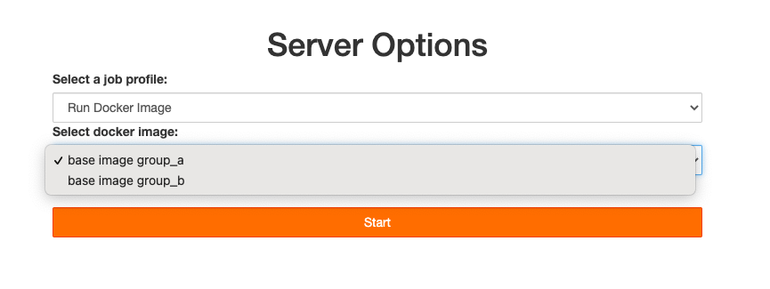

# experiment-wrapspawner

A custom wrapspawner to present a custom form in base of user's groups.



## :rocket: How to use it

Build the image and run with Docker:

```bash
docker build -t wrapspawner:v0 .
docker run -ti --rm -p 8000:8000 -v /var/run/docker.sock:/var/run/docker.sock -e JUPYTERHUB_CRYPT_KEY=$(openssl rand -hex 32) wrapspawner:v0
```

## :books: Doc

Important steps to make a custom user experience:

1. Enable the `auth_state` in the `jupyterhub_config.py`:

   ```python
   c.Authenticator.enable_auth_state = True
   ```

2. Customize the authenticator hook with the new metadata:

   ```python
   def my_hook(authenticator, handler, authentication):
    if authentication["auth_state"] is None:
        authentication["auth_state"] = {}
    authentication["auth_state"]["groups"] = ["group_a", "group_b"]

    return authentication


   c.Authenticator.post_auth_hook = my_hook
   ```

3. Customize the Ppawner hook to intercept the user metadata (groups):

   ```python
   def auth_state_hook(spawner, auth_state: dict):
    spawner.groups = auth_state["groups"]


   c.Spawner.auth_state_hook = auth_state_hook
   ```

4. Write a custom Spawner class and add it to `jupyterhub_config.py` and also in the `wrapspawner` package:

   ```python
   c.JupyterHub.spawner_class = "wrapspawner.CustomDockerProfilesSpawner"
   ```

### :bookmark_tabs: Reference

* [wrapspawner](https://github.com/jupyterhub/wrapspawner) original repo
